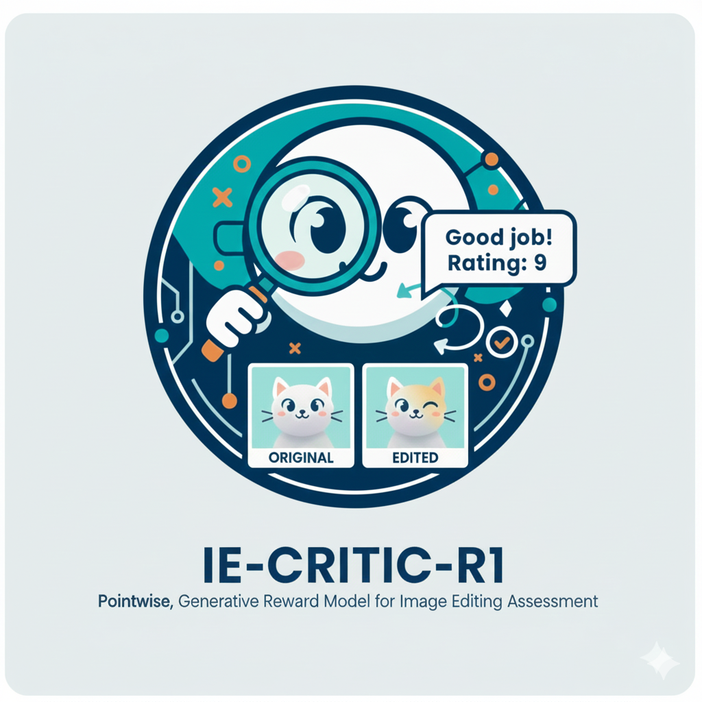
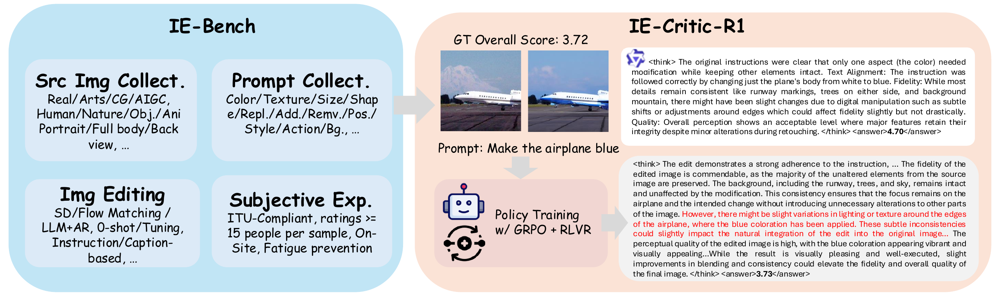
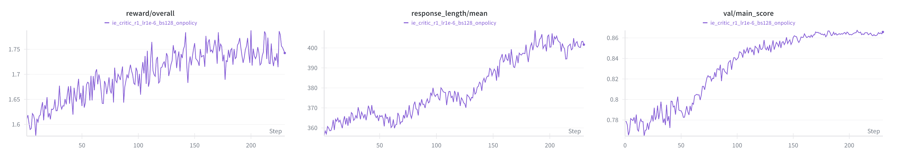

<div align="center">

<h1>IE-Critic-R1</h1>
<h3>Advancing the Explanatory Measurement of Text-Driven Image Editing for Human Perception Alignment</h3>

[Bowen Qu](https://github.com/Coobiw)<sup>1\*</sup>, [Shangkun Sun](https://github.com/littlespray)<sup>1,2\*</sup>,  Xiaoyu Liang<sup>1</sup>, Wei Gao<sup>1,2</sup>

<sup>1</sup> Peking University,
<sup>2</sup> Peng Cheng Laboratory

(\* equal contribution)

[](https://arxiv.org/abs/2511.18055)
[](https://huggingface.co/Coobiw/IE-Critic-R1-7B)
[](https://huggingface.co/datasets/Coobiw/IE-Bench-4k)
[](https://huggingface.co/datasets/Coobiw/IE-Bench-CoT-mixed)


*If you have any question, feel free to contact [📧](mailto:brian.bw.qu@gmail.com).*

</div>

-------




<p align="center" style="color: gray;"><em>The "R1 Moment" of Image Editing Quality Assessment.</em></p>

**IE-Critic-R1** is a Multimodal Large Language Model (MLLM) specialized in assessing the quality of text-driven image editing results. It is a pointwise, generative reward model, leveraging Chain-of-Thought (CoT) reasoning SFT and RLVR to provide accurate, human-aligned evaluations of image editing.

## News

*   **[2025.11]** IE-Bench-4k, IE-Critic-R1 Model and all the SFT Data are released on HuggingFace.🤗

## Introduction

IE-Critic-R1, a pointwise generative reward model, treats image editing quality assessment as a reasoning task. Unlike traditional score prediction models, IE-Critic-R1 generates a reasoning trace (within `<think>...</think>`) before outputting the final score (within `<answer>...</answer>`). This approach improves the explainability and accuracy of the assessment.

Key features:
*   **Comprehensive Evaluation**: We propose IE-Bench-4k, a comprehensive benchmark for text-driven image editing quality assessment, including text alignment, fidelity, perceptual quality and the overall score.
*   **Chain-of-Thought Reasoning**: Explicitly reasons about text alignment, fidelity, and perceptual quality before final scoring.
*   **Reinforcement Learning**: Optimized using GRPO with verifiable reward to align with human preferences (MOS).
*   **Superior Performance**: Achieves state-of-the-art performance on our proposed IE-Bench-4k dataset, as well as AGIQA-3k (a benchmark for AGI-generated image quality assessment).

## Installation

1.  **Clone the repository**:
    ```bash
    git clone https://github.com/Coobiw/IE-Critic-R1.git
    cd IE-Critic-R1
    ```

2.  **Create a conda environment**:
    ```bash
    conda create -n ie_critic python=3.10
    conda activate ie_critic
    ```

3.  **Install dependencies**:
    ```bash
    pip install -r requirements.txt
    ```
    *Note: You may need to install `flash-attn` separately depending on your CUDA version.*

## Dataset: IE-Bench-4k

We release the **IE-Bench-4k** dataset, which contains source images, edited images, editing instructions, and human-annotated quality scores (MOS).

Download it from HuggingFace: [Coobiw/IE-Bench-4k](https://huggingface.co/datasets/Coobiw/IE-Bench-4k)

p.s.: We also release the mixed SFT Data (including CoT data and direct-scoring data) on HuggingFace: [Coobiw/IE-Bench-CoT-mixed](https://huggingface.co/datasets/Coobiw/IE-Bench-CoT-mixed). You can use it to train Qwen-2.5-VL model to get IE-Critic-CoT model with [LLaMA-Factory](https://github.com/hiyouga/LLaMA-Factory) repository.

## Training

IE-Critic-R1 is trained using the [EasyR1](https://github.com/hiyouga/EasyR1) library with GRPO algorithm.

To train the model:

1.  Configure the training parameters in `examples/config_ie_critic_r1.yaml`.
2.  Set the `MODEL_PATH` in `examples/ie_critic_r1.sh` to your base model path (e.g., a SFT model (IE-Critic-CoT) or `Qwen/Qwen2.5-VL-7B-Instruct`).
3.  Run the training script:
    ```bash
    bash examples/ie_critic_r1.sh
    ```

The training uses IE-Critic-CoT as the base model and optimizes it against the `IE-Bench-4k` dataset using a reward function based on the L1/Gaussian/Laplace distance to the ground truth score (**L1 is the final choice for R1 moment**).

## Evaluation

### Normal
To evaluate the trained model on the test set:

```bash
python scripts/iebench_eval.py --output_fname results/ie_critic_r1_test.json --save
```

This script will:
1.  Load the model (default: `Coobiw/IE-Critic-R1-7B`).
2.  Run inference on the `IE-Bench-4k` test set.
3.  Extract the score from the generated response.
4.  Calculate PLCC (Pearson Linear Correlation Coefficient) and SRCC (Spearman Rank Correlation Coefficient) against human scores.

### vLLM

To evaluate the trained model on the test set using vLLM:

```bash
bash scripts/vllm_serve.sh Coobiw/IE-Critic-R1-7B IE-Critic-R1-7B
python scripts/iebench_eval_vllm.py --output_fname results/ie_critic_r1_test.json --save --api_url http://localhost:8000
```

This script will:
1.  Load the model (default: `Coobiw/IE-Critic-R1-7B`).
2.  Run inference on the `IE-Bench-4k` test set using vLLM.
## Usage Example

```python
from transformers import Qwen2_5_VLForConditionalGeneration, AutoProcessor
from qwen_vl_utils import process_vision_info

model = Qwen2_5_VLForConditionalGeneration.from_pretrained(
    "Coobiw/IE-Critic-R1-7B", torch_dtype="bf16", device_map="cuda"
).eval()
processor = AutoProcessor.from_pretrained("Coobiw/IE-Critic-R1-7B")

messages = [
    {
        "role": "user",
        "content": [
            {"type": "image", "image": "path/to/source.jpg"},
            {"type": "image", "image": "path/to/edited.jpg"},
            {"type": "text", "text": "Edit Instruction: Make the sky blue.\n..."}
        ]
    }
]

# ... (Inference code)
```

## Citation

If you find this project useful, please cite our paper:

```bibtex
@article{IECriticR1,
    title={IE-Critic-R1: Advancing the Explanatory Measurement of Text-Driven Image Editing for Human Perception Alignment},
    author={Bowen Qu and Shangkun Sun and Xiaoyu Liang and Wei Gao},
    journal={arXiv preprint arXiv:2511.18055},
    year={2025}
}
```

## Acknowledgement

*   This project is built upon [Qwen2.5-VL](https://github.com/QwenLM/Qwen2.5-VL)
*   [LLaMA-Factory](https://github.com/hiyouga/LLaMA-Factory) for the SFT framework.
*   [EasyR1](https://github.com/hiyouga/EasyR1) and [verl](https://github.com/volcengine/verl) for the RLVR training framework.
*   [vLLM](https://github.com/vllm-project/vllm) for the vLLM serving framework.

